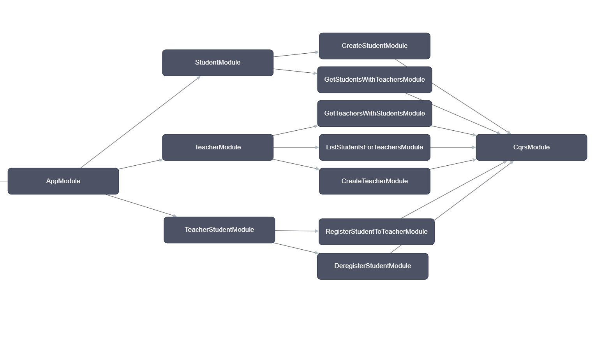

# School Admininstrative System API made with NestJS and DynamoDB

## Installation
> **Prerequisites**: requires node and docker installed

```bash
$ npm install
```

## Setting up the DB

```bash
# Start Docker Compose
$ npm run db

# Create the table
$ npm run ctbl

# Check table is created
$ npm run lstbl
```

## Running the app

```bash
# development
$ npm run start

# watch mode
$ npm run start:dev
```

## Test

```bash
# unit tests
$ npm run test

# watch mode
$ npm run test:watch

# test coverage
$ npm run test:cov
```
Postman collection file included as well to test endpoints

## Entities

- Teacher
- Student
- TeacherStudent - to address many-to-many relationship between Teachers and Students

## Entity chart

<table>
  <thead>
    <tr>
      <th>ENTITY</th>
      <th>PK</th>
      <th>SK</th>
    </tr>
  </thead>
  <tbody>
    <tr>
      <td>Student</td>
      <td>STUDENT#&lt;StudentEmail&gt;</td>
      <td>STUDENT#&lt;StudentEmail&gt;</td>
    </tr>
    <tr>
      <td>Teacher</td>
      <td>TEACHER#&lt;TeacherEmail&gt;</td>
      <td>TEACHER#&lt;TeacherEmail&gt;</td>
    </tr>
    <tr>
      <td>TeacherStudent</td>
      <td>TEACHER#&lt;TeacherEmail&gt;</td>
      <td>STUDENT#&lt;StudentEmail&gt;</td>
    </tr>
  </tbody>
</table>

## GSI1 TABLE

<table>
  <thead>
    <tr>
      <th>ENTITY</th>
      <th>GSI1PK</th>
      <th>GSI1SK</th>
    </tr>
  </thead>
  <tbody>
    <tr>
      <td>Student</td>
      <td>STUDENT#INDEX</td>
      <td>STUDENT#&lt;StudentEmail&gt;</td>
    </tr>
    <tr>
      <td>Teacher</td>
      <td>TEACHER#INDEX</td>
      <td>TEACHER#&lt;TeacherEmail&gt;</td>
    </tr>
    <tr>
      <td>TeacherStudent</td>
      <td>STUDENT#&lt;StudentEmail&gt;</td>
      <td>TEACHER#&lt;TeacherEmail&gt;</td>
    </tr>
  </tbody>
</table>

## Access patterns

<table border="1">
  <thead>
    <tr>
      <th>ENTITY</th>
      <th>ACCESS PATTERN</th>
      <th>INDEX</th>
      <th>PARAMS</th>
      <th>NOTES</th>
    </tr>
  </thead>
  <tbody>
    <tr>
      <td rowspan="2">Student</td>
      <td>Create</td>
      <td>/</td>
      <td>pk: STUDENT#&lt;StudentEmail&gt; sk: STUDENT#&lt;StudentEmail&gt;</td>
      <td>/</td>
    </tr>
    <tr>
      <td>Get</td>
      <td>GSI1</td>
      <td>pk: STUDENT#INDEX</td>
      <td>Projection Expression: email</td>
    </tr>
    <tr>
      <td rowspan="2">Teacher</td>
      <td>Create</td>
      <td>/</td>
      <td>pk: TEACHER#&lt;TeacherEmail&gt; sk: TEACHER#&lt;TeacherEmail&gt;</td>
      <td>/</td>
    </tr>
    <tr>
      <td>Get</td>
      <td>GSI1</td>
      <td>pk: TEACHER#INDEX</td>
      <td>Projection Expression: email</td>
    </tr>
    <tr>
      <td rowspan="4">TeacherStudent</td>
      <td>Register student to teacher</td>
      <td>/</td>
      <td>pk: TEACHER#&lt;TeacherEmail&gt; sk: STUDENT#&lt;StudentEmail&gt;</td>
      <td>Many-to-many rel for teachers and students, uses GSI1</td>
    </tr>
    <tr>
      <td>Deregister student from teacher</td>
      <td>/</td>
      <td>pk: DOCTOR#&lt;DoctorId&gt; sk: PATIENT#&lt;PatientId&gt;</td>
      <td>/</td>
    </tr>
    <tr>
      <td>List of students with teachers that they are assigned to</td>
      <td>GSI1</td>
      <td>pk: STUDENT#&lt;StudentEmail&gt; sk: begins_with(TEACHER#)</td>
      <td>Using the list of student emails from the student GET request</td>
    </tr>
    <tr>
      <td>List of teachers with students assigned under them</td>
      <td>/</td>
      <td>pk: TEACHER#&lt;TeacherEmail&gt; sk: begins_with(STUDENT#)</td>
      <td>Using the list of teacher emails from the teacher GET request</td>
    </tr>
  </tbody>
</table>

## Modules map


These modules are dependent on the global dynamoModule

## References
### Set up
- [How to Build a Serverless REST API with NestJS and DynamoDB](https://serverlesscorner.com/how-to-build-a-serverless-rest-api-with-nestjs-and-dynamodb-7b58b5b59bf6)
- [Implementing NestJS API using AWS DynamoDB locally with Docker](https://ututuv.medium.com/implementing-nestjs-api-using-aws-dynamodb-locally-with-docker-84371d79f2c)
### Single table design
- [7 Common DynamoDB Patterns for Modeling and Building an App with Alex De Brie](https://www.youtube.com/watch?v=Q6-qWdsa8a4)
- [This project was built for a DynamoDB demo in the previous video^](https://github.com/alexdebrie/dynamodb-instagram?tab=readme-ov-file)
- [DynamoDB Design Patterns for Single Table Design](https://www.serverlesslife.com/DynamoDB_Design_Patterns_for_Single_Table_Design.html)
### CQRS Pattern
- [Creating a Todo API using NestJS and CQRS Pattern](https://engcfraposo.medium.com/creating-a-todo-api-using-nestjs-and-cqrs-pattern-8dd27dec9182)
- [CQRS Software Architecture Pattern: The Good, the Bad, and the Ugly](https://medium.com/@emer.kurbegovic/cqrs-software-architecture-pattern-the-good-the-bad-and-the-ugly-efe48e8dcd14)
### Testing
- [A repository to show off to the community methods of testing NestJS](https://github.com/jmcdo29/testing-nestjs)
- [Mocking modular AWS SDK for JavaScript (v3) in Unit Tests](https://aws.amazon.com/blogs/developer/mocking-modular-aws-sdk-for-javascript-v3-in-unit-tests/)
